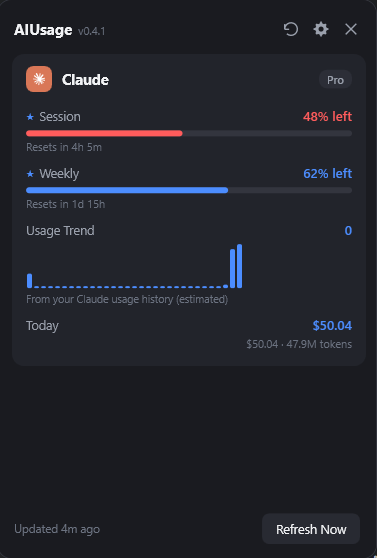

# AIUsage.NET

Track your AI coding subscriptions from the Windows system tray — a .NET port of
[OpenUsage](https://github.com/robinebers/openusage). See the
[landing page](https://luigiellebalotta.github.io/AIUsage.NET/) for a quick overview.

AIUsage.NET shows how much of your AI coding plans you've used: session and weekly limits, credits,
and spend, all in one popup window. It follows the same architecture and behavior as the original
macOS/Swift edition, adapted for Windows — see [PORTING_NOTES.md](PORTING_NOTES.md) for exactly what
was ported faithfully, simplified, or is not yet implemented.

<p align="center">
  
</p>

## Status

This is an early, functional port. The provider engine, CLI, and tray UI all work end-to-end with a
dark theme, real progress bars, and provider brand icons, but several features from the original
aren't ported yet (see [PORTING_NOTES.md](PORTING_NOTES.md) for the full list: per-metric Customize,
charts, local HTTP API, code signing, multi-account support, iCloud-equivalent sync, and more).

## Supported Providers

- **Antigravity** — shared Gemini and Claude pool quotas, 5-hour and weekly windows
- **Claude** — session, weekly, model-specific limits, extra usage, local daily spend
- **Codex** — session, weekly, credits, local daily spend
- **Copilot** — AI credits, extra usage, organization billing, chat and completions
- **Cursor** — credits, total/auto/API usage, requests, on-demand, per-day spend
- **Devin** — weekly and daily quota, extra usage balance
- **Grok** — weekly shared pool, pay-as-you-go, local daily spend

> **Kiro** was added in 0.3.0 and disabled in 0.4.1 pending a fix for a bug that could force a
> logout in the live Kiro IDE session — see
> [docs/providers/kiro.md](docs/providers/kiro.md) and
> [issue #8](https://github.com/LuigiElleBalotta/AIUsage.NET/issues/8).
- **OpenCode** — Go session/weekly/monthly caps, local daily spend
- **OpenRouter** — credit balance, daily/weekly/monthly spend (API key)
- **Z.ai** — session, weekly, web-search quotas (API key)

Most providers read the credentials already on your machine (Windows Credential Manager, auth files,
app state) — no extra login. OpenRouter and Z.ai are the exceptions: you supply an API key. See
[docs/providers/](docs/providers/) for each provider's credential sources and metrics.

## Installation

**Winget** (pending review — see [microsoft/winget-pkgs#405974](https://github.com/microsoft/winget-pkgs/pull/405974)):

```powershell
winget install LuigiElleBalotta.AIUsageNET
```

**Or manually:** download `AIUsage-Setup.exe` from the [latest release](https://github.com/LuigiElleBalotta/AIUsage.NET/releases/latest)
and run it — it installs to your user profile (no admin required) and adds a Start Menu shortcut. Not
code-signed yet, so Windows SmartScreen will warn on first run (click "More info" → "Run anyway"); see
[PORTING_NOTES.md](PORTING_NOTES.md) for what's left to do there.

Once installed, the app checks for updates automatically (via [Velopack](https://velopack.io), reading
this repo's GitHub Releases) and offers to download and install them from the tray menu — no manual
zip download needed for future versions. A portable (no-installer) zip is also attached to each
release if you'd rather not install it.

To build from source instead:

```powershell
git clone https://github.com/LuigiElleBalotta/AIUsage.NET.git
cd AIUsage.NET
script/build_and_run.ps1
```

Requires [.NET 8 SDK](https://dotnet.microsoft.com/download/dotnet/8.0) and Windows 10 or later.

## Features

- **Tray icon + popup window.** Click the tray icon for a metrics list grouped by provider,
  color-coded by severity (used/warning/critical).
- **Stale-while-revalidate.** Cached values display instantly at launch; refresh runs every 5 minutes.
- **[One-shot CLI](docs/cli.md).** Read usage as JSON through the same five-minute cache with
  `aiusage`, or bypass freshness with `aiusage --force`; the tray app does not need to be running.
- **[Proxy support](docs/proxy.md).** Route provider requests through HTTP(S) via
  `~/.aiusage/config.json` (SOCKS5 config is read but degraded — see the doc for why).
- **[Model pricing](docs/pricing.md).** Local spend estimates from the same three-layer pricing
  engine as the original (bundled snapshots + live LiteLLM/models.dev/supplement fetches).

## Documentation

Behavior docs live in [docs/](docs/README.md): the [dashboard](docs/dashboard.md), [refresh &
caching](docs/refreshing.md), the [CLI](docs/cli.md), the [proxy](docs/proxy.md), and one page per
provider.

For working on the code, see the developer docs: [architecture](docs/architecture.md), [adding a
provider](docs/adding-a-provider.md), and [debugging & logs](docs/debugging.md).

## Building

```powershell
dotnet build AIUsage.sln              # build everything
script/build_and_run.ps1              # build and launch the tray app
script/build_and_run.ps1 -Mode cli claude --force   # build and run the CLI
```

## Architecture

.NET 8 solution: `AIUsage.Core` (shared library — models, providers, pricing, stores), `AIUsage.Tray`
(WPF tray app), `AIUsage.Cli` (console app). Providers implement a small `IProviderRuntime` interface
(auth store → usage client → mapper → `ProviderSnapshot`), and both the tray app and CLI read the same
normalized data — see [docs/architecture.md](docs/architecture.md) and
[AGENTS.md](AGENTS.md) for engineering conventions.

## Releasing

`script/release.ps1 -Version 0.3.1` publishes the tray app self-contained, then packages it with
[Velopack](https://velopack.io)'s `vpk pack` into an installer, a portable zip, and the delta-update
feed installed apps poll (`releases.win.json`); the CLI is published and zipped separately. Pushing a
`v*` tag runs the same build in CI and publishes every asset to a GitHub Release (see
[.github/workflows/release.yml](.github/workflows/release.yml)) — that release is also what
`UpdateChecker` reads on every user's machine, so nothing else needs to be updated for auto-update to
pick up a new version. There is no code signing yet, so Windows SmartScreen will warn on first run —
see [PORTING_NOTES.md](PORTING_NOTES.md) for what's left to do there.

## Contributing

Issues and pull requests are welcome — read [CONTRIBUTING.md](CONTRIBUTING.md) first. Report security
issues privately per [SECURITY.md](SECURITY.md). See [TRADEMARK.md](TRADEMARK.md) for this project's
relationship to the original OpenUsage name and brand.

## License

[MIT](LICENSE)
